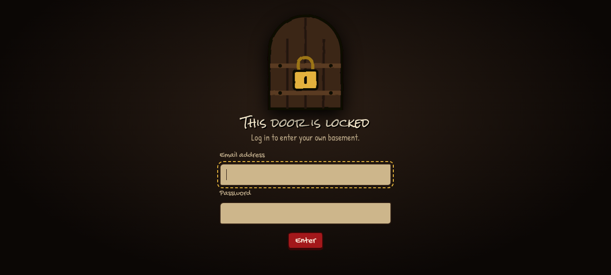
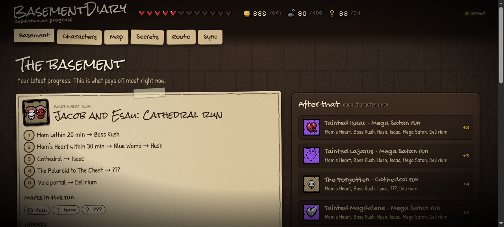
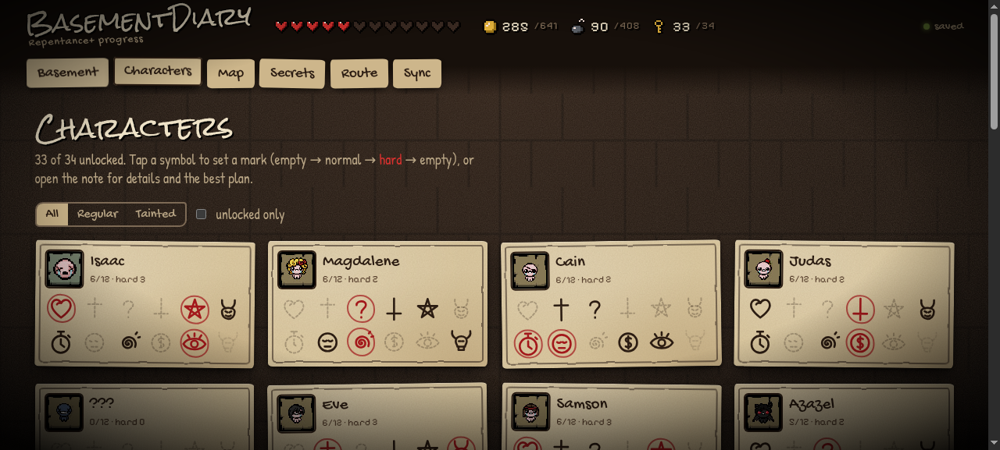
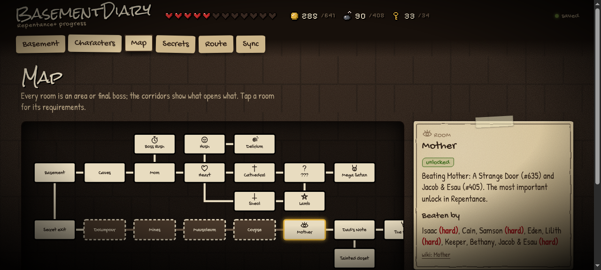
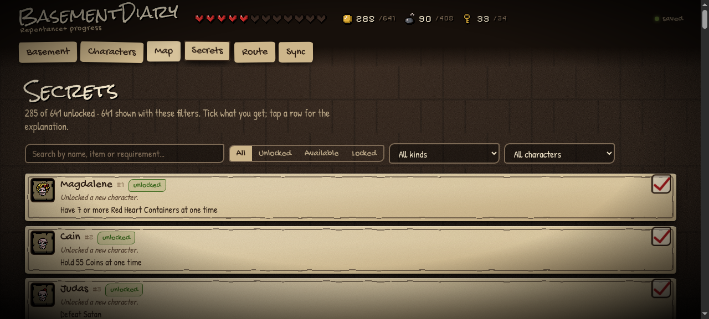
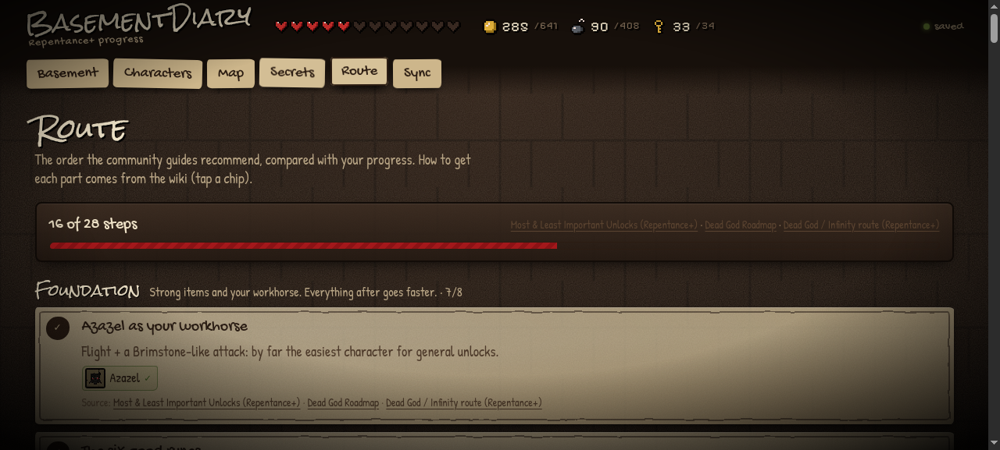

# BasementDiary

A self-hosted progress tracker for **The Binding of Isaac: Repentance+**, styled after the
game: a dark basement, paper notes and a pixel HUD.

BasementDiary reads your real save file, works out what each unlock depends on, and tells
you which run pays off most next. You can use it for every achievement, character and
completion mark, from the first run to Dead God. Every account keeps its own progress, and
on Windows your save can sync by itself each time you quit the game.

> **Status:** version 1.0.0 &nbsp;·&nbsp; **License:** [PolyForm Noncommercial 1.0.0](LICENSE)
> (application code only; see [License](#license)) &nbsp;·&nbsp; Fan project, not affiliated
> with Nicalis or Edmund McMillen.

**Requirements**

| To… | You need |
|---|---|
| Self-host | A Linux server with Docker and Docker Compose, a domain, and an HTTPS reverse proxy (e.g. nginx with Let's Encrypt) |
| Develop locally | Node.js 20 or newer |
| Sync automatically | Windows with Windows PowerShell 5.1 (built into Windows 10/11), and The Binding of Isaac: Rebirth + Repentance+ on Steam |

## Contents

- [Screenshots](#screenshots)
- [Features](#features)
- [Playing Isaac with automatic sync (Windows)](#playing-isaac-with-automatic-sync-windows)
- [Self-hosting on Linux (quickstart)](#self-hosting-on-linux-quickstart)
- [Local development](#local-development)
- [Tests](#tests)
- [Data generation](#data-generation)
- [Project layout](#project-layout)
- [Configuration](#configuration)
- [Accounts and security](#accounts-and-security)
- [Limitations](#limitations)
- [License](#license)
- [Sources](#sources)

## Screenshots

<p align="center">
  
</p>
<p align="center"><em>The public login screen. Everything else is behind an account.</em></p>

The following representative signed-in screens use synthetic demo progress; no private user data is included.

<p align="center">
  
</p>
<p align="center"><em>Basement dashboard with progress at a glance.</em></p>

<p align="center">
  
</p>
<p align="center"><em>Character completion marks and progress.</em></p>

<p align="center">
  
</p>
<p align="center"><em>Progression map for the major game paths.</em></p>

<p align="center">
  
</p>
<p align="center"><em>Searchable secret and achievement unlocks.</em></p>

<p align="center">
  
</p>
<p align="center"><em>Recommended route order and current progress.</em></p>

## Features

- **All your unlocks**: 641 achievements, 34 characters, 408 completion marks (normal and hard).
- **Real dependencies**: every unlock knows what it needs. Downpour only opens after
  *A Secret Exit* (Hush 3x), The Beast only after *A Strange Door* (Mother), and so on.
  Anything still locked shows the chain of what you have to do first.
- **Ticking off**: tap a mark (empty → normal → hard). The unlocks that come with it follow automatically.
- **Route advice**: per character the run that pays off most right now, the "Best next
  runs" across all characters, and your place in the meta route from three popular
  Steam guides. Unlocks the guides recommend postponing (Missing No., TMTRAINER…) get a
  warning and are skipped in plans.
- **Unlock details**: item unlocks show their Item Quality (Q0-Q4), challenges a short tip.
- **Sync**: import your save file (exact, including Hard marks and counters such as the
  Greed machine), fill gaps from Steam achievements, or sync automatically after playing
  with `tools/sync-save.ps1` on Windows.
- **Accounts**: email and password; progress and save uploads are strictly per account.
  Registration is closed by default and only the admin can open it. Rate limits,
  revocable sessions.

## Playing Isaac with automatic sync (Windows)

The script needs to know which server to sync to; there is no built-in default. On the
first run it asks for the address (or takes it from `-Server`) and remembers it, so later
runs need no arguments. The *Sync* page on the site shows the address and the exact
command. Below, `https://your-domain.example` stands for that address.

Install The Binding of Isaac: Rebirth and Repentance+ through Steam, and sign in to the
Steam client on Windows before using the shortcut.

1. Download or clone this repository and keep it in a fixed place; the shortcut runs
   `tools/sync-save.ps1` from there.
2. Run this once in PowerShell from the repository folder:

   ```powershell
   powershell -ExecutionPolicy Bypass -File tools\sync-save.ps1 -Server https://your-domain.example -InstallShortcut
   ```

   Without `-Server`, the script first asks for the server address.
3. Log in with your email address and password. Creating a new account here (or on the
   site) only works while the admin has registration open.
4. The script puts an **Isaac + sync** shortcut on your desktop. From now on, always start
   Isaac with that shortcut: it launches the game via Steam and uploads your save
   automatically as soon as you quit. No manual upload or sync is needed after this setup.

The script never stores your password. The server issues a sync token for this PC, kept encrypted
with Windows DPAPI (readable only by your Windows account); you can revoke it on the site
under *Sync → Account*; the script then asks you to log in again. The server address and
your email address are saved in `%APPDATA%\boipt\config.json`. Run the script with
`-ResetLogin` to forget the saved server and login and enter them again (to switch
accounts or servers). More options: [DEPLOY.md](DEPLOY.md#8-windows-sync-your-save-automatically).

## Self-hosting on Linux (quickstart)

You need a Linux server with Docker and Docker Compose, a domain whose DNS points to the
server, and an HTTPS reverse proxy (e.g. nginx with Let's Encrypt) in front of the app.

```bash
git clone https://github.com/raylano/Binding-Of-Isaac-Progress-Tracker.git ~/BOIPT && cd ~/BOIPT
cp .env.example .env
chmod 600 .env
```

Edit `.env` (placeholders only; never commit real values). Set `PUBLIC_URL` to your own
public origin; `https://your-domain.example` is only a placeholder:

```
PUBLIC_URL=https://your-domain.example
ADMIN_EMAIL=you@example.com
ADMIN_PASSWORD=
PORT=8090
TRUST_PROXY=1
```

Before the first start, set `ADMIN_PASSWORD` in this local `.env` to a unique one-time
password of at least 12 characters. Do not commit the value; remove it after the admin
account has been created.

Start and check:

```bash
docker compose up -d --build
curl -fsS http://127.0.0.1:8090/api/health    # {"ok":true}
```

The first start creates the admin account. Then remove the `ADMIN_PASSWORD` line from
`.env` and recreate the container (`docker compose up -d`). Registration stays closed
until the admin opens it under *Sync → Admin*.

For the full nginx/TLS, DNS, update and backup instructions see [DEPLOY.md](DEPLOY.md).

## Local development

Requires Node.js 20 or newer.

```bash
npm install
cp .env.example .env
```

Edit `.env` for local use:

```
PORT=8090
PUBLIC_URL=http://localhost:8090
TRUST_PROXY=0
ADMIN_EMAIL=you@example.com
ADMIN_PASSWORD=
```

For local development, set `ADMIN_PASSWORD` in `.env` to a unique password of at least
12 characters before the first start. Keep it local and remove it after account creation.

Start the server:

```bash
npm run dev
```

The site runs on http://localhost:8090. On the first start the admin account for
`ADMIN_EMAIL` is created from `ADMIN_PASSWORD`; remove `ADMIN_PASSWORD` from `.env`
afterwards. Log in with it; the admin can open registration under *Sync → Admin*.

## Tests

```bash
npm test
```

The tests use their own temporary data directories. Tests that need sign-ups open
registration in their own setup; `tests/registration.test.js` checks the production
default (closed), the admin toggle and the sign-up rate limit.

With your real save as well (never committed):

```bash
ISAAC_SAVE="C:/Program Files (x86)/Steam/userdata/<id>/250900/remote/rep+persistentgamedata1.dat" npm test
```

## Data generation

`web/data/achievements.json` comes from the wiki and Steam and is part of the repo.
Fetch it again (only needed when the game gets new achievements):

```bash
npm run build-data
```

`web/data/item-quality.js` (Item Quality per item unlock) is built from locally saved
source pages, without network access:

```bash
node scripts/build-quality.mjs [source-dir]           # rewrites the file
node scripts/build-quality.mjs [source-dir] --check   # only checks
```

Only achievements that add a collectible to the pool get a tier (Q0–Q4, using the
Repentance+ value). The generator reads saved source pages and keeps known conflicts in
`QUALITY_CONFLICTS`; unresolved items use the documented wiki value. Trinkets, cards,
runes, pills and pickups have no collectible Quality and are listed in `NO_QUALITY_SOURCE`.

## Project layout

| Path | What |
|---|---|
| `server/` | Express: static site, accounts and sessions, rate limits, progress per account, Steam proxy, save upload |
| `server/accounts.js` | Accounts (`data/users.json`) and sessions (`data/sessions.json`) |
| `server/admin.js` | Site settings (`data/settings.json`: registration open/closed) and creating the admin account |
| `server/passwords.js` | Email normalisation, password rules, scrypt hashes |
| `server/store.js` | Progress in `data/users/<id>/progress.json` |
| `web/js/save-parser.js` | Reads `rep+persistentgamedata*.dat` (achievements, marks, counters); runs in browser and Node |
| `web/js/logic.js` | Dependencies: what is unlocked, available or locked, and why |
| `web/js/advisor.js` | Run planner and meta route |
| `web/data/characters.js` | Characters and marks in save order |
| `web/data/route.js` | Meta route and "better postpone", with sources |
| `web/data/item-quality.js` | Item Quality per item unlock (generated by `scripts/build-quality.mjs`) |
| `web/data/challenge-tips.js` | Tip per challenge #1-#45, with wiki source |
| `web/js/unlock-info.js` | Q badge and challenge tip for the unlock drawer |
| `tools/sync-save.ps1` | Windows: send your save to your account without a browser, also automatically after playing |
| `docs/screenshots/` | Screenshots used in this README |

Deployment: see [DEPLOY.md](DEPLOY.md).

## Configuration

All settings are environment variables; see [.env.example](.env.example). The public
origin of your instance is never hardcoded: set it with `PUBLIC_URL` in `.env`.

| Variable | Meaning |
|---|---|
| `PORT` | Port (Docker: host port on 127.0.0.1; the container always listens on 8080). |
| `PUBLIC_URL` | Public origin, e.g. `https://your-domain.example`. Used in the sync-script command on the Sync page. HTTPS only (HTTP is allowed for localhost). Empty means the page uses its own address. |
| `ADMIN_EMAIL` | The account with this address is the admin and can open or close registration. This address can never be taken via sign-up. |
| `ADMIN_PASSWORD` | One-time: creates the admin account on startup if it does not exist yet. Hashed, removed from the process environment, never logged; ignored once the account exists. Remove it after the first start. |
| `STEAM_API_KEY` | Optional Steam Web API key. Without it the public profile page is used. |
| `TRUST_PROXY` | Number of proxies in front of the app (`1` behind nginx, `0` locally). |

`ACCESS_PIN`, `STEAM_ID` and `SESSION_SECRET` are no longer used; the server warns if
they are still set.

## Accounts and security

| Topic | Choice |
|---|---|
| Registration | Closed by default (also when `data/settings.json` is missing or unreadable). Only the admin opens or closes it, on the Sync page; the setting is stored in `data/settings.json`. While closed, `POST /api/register` returns `403` before anything else is checked, and the sign-up tab is hidden. Existing accounts can always log in. |
| Admin | The account for `ADMIN_EMAIL`, created once from `ADMIN_PASSWORD`. Admin actions require a browser session; a sync token cannot change settings. |
| Email | Trimmed and lowercased (dots and `+label` stay). No email verification or password reset by mail: the server sends no mail. |
| Password | 12 to 128 characters, not one repeated character, not equal to the email address. Stored as scrypt (N=32768, r=8, p=1, 16-byte salt, 64-byte hash); the parameters are part of the hash so they can be raised later. |
| Duplicate account | `409`. That reveals that an address exists; a deliberate trade-off for a clear message, limited by the sign-up rate limit. Login gives exactly the same answer for an unknown address and a wrong password, and computes a hash in both cases. |
| Sessions | 32 random bytes in an `HttpOnly; SameSite=Strict; Path=/` cookie (`Secure` behind HTTPS), valid for 30 days. Only the SHA-256 is stored on disk. A new token at every login. Logout and revoking take effect immediately. At most 50 sessions per account. |
| Sync script | Gets a separate token via `POST /api/token` (valid for a year), sent as `Authorization: Bearer <sync-token>`. A browser cookie is not a bearer token, and vice versa. The password is never stored. |
| CSRF | `SameSite=Strict`, plus: changing requests with an `Origin` of another host or `Sec-Fetch-Site: cross-site` get `403`. |
| Rate limits | Login/token: 5 failures and 30 attempts in total (scrypt is expensive) per IP per 15 min. Deliberately no hard limit per account: that would let a stranger lock the owner out; the 12+ character rule protects against guessing across many IPs. Sign-up: 10 attempts per IP per hour, counted whether registration is open or closed. Unknown bearer tokens: 20 per IP per 15 min. Counters live in memory and reset on restart. |
| Isolation | Progress lives in `data/users/<id>/progress.json`; the ID is 32 hex characters generated by the server and checked before it becomes a path. Steam sync only uses the SteamID stored with the account. |
| Concurrency | Read-modify-write per account goes through a lock; files are written atomically (`0600`, directory `0700`). One server process per data directory: accounts and sessions are kept in memory. |
| Not included | Deleting accounts, changing/forgetting passwords, 2FA, email verification. Forgotten password = the server operator edits `data/users.json`. |

## Limitations

- **Automatic sync is Windows-only.** `tools/sync-save.ps1` targets Windows PowerShell
  5.1. On other platforms, upload your save file on the site or fill gaps from Steam
  achievements.
- **Steam sync needs public game details.** With or without `STEAM_API_KEY`, it only works
  if "Game details" is set to Public in the player's Steam privacy settings.
- **No account self-service.** There is no account deletion, no password change or reset,
  no 2FA, and no email verification. The server sends no mail.
- **Single process.** Run one server process per data directory, because accounts and
  sessions are kept in memory. Rate-limit counters reset on restart.
- **Game data is a snapshot.** If the game gets new achievements, regenerate
  `web/data/achievements.json` with `npm run build-data`.
- **Item Quality covers collectibles only.** Trinkets, cards, runes, pills and pickups
  have no Q tier.

## License

Original BasementDiary application code is licensed under the [PolyForm Noncommercial License 1.0.0](LICENSE).
It allows use, modification, and redistribution for noncommercial purposes; commercial use
requires separate permission. The license does not cover third-party software, data/content,
fonts, game assets, or trademarks; those remain under their own terms and attributions below.

## Sources

Third-party sources and attributions. These materials are not covered by this project's
license and stay under their own terms.

- Unlock requirements: [Binding of Isaac: Rebirth Wiki](https://bindingofisaacrebirth.wiki.gg/wiki/Achievements) (CC BY-SA 3.0), via the Cargo export.
- Save format: [REPENTOGON EventCounter](https://repentogon.com/enums/EventCounter.html), cross-checked with the offsets from [isaac-save-edit-script](https://github.com/jamesthejellyfish/isaac-save-edit-script) (MIT).
- Route advice: [Most & Least Important Unlocks](https://steamcommunity.com/sharedfiles/filedetails/?id=2994836310), [Dead God Roadmap](https://steamcommunity.com/sharedfiles/filedetails/?id=2980920774), [Dead God / Infinity route](https://steamcommunity.com/sharedfiles/filedetails/?id=3712501774).
- Item Quality: [Items](https://bindingofisaacrebirth.wiki.gg/wiki/Items) and [Item Quality](https://bindingofisaacrebirth.wiki.gg/wiki/Item_Quality) on the Rebirth Wiki (CC BY-SA 3.0), checked against [Platinum God](https://www.tboi.com/all-items). The Q0-Q4 label follows the `{{Quality0}}`-`{{Quality4}}` glyphs of [External Item Descriptions](https://github.com/wofsauge/External-Item-Descriptions) (frames 0-4 of the `Quality` animation in [`eid_inline_icons.anm2`](https://github.com/wofsauge/External-Item-Descriptions/blob/master/resources/gfx/eid_inline_icons.anm2)/`eid_inline_icons.png`). The badge colours are the dominant filled RGB colour per frame, sampled from that sprite (crop x=44/55/66/77/88, y=32, 10x10): Q0 `#C2C2C2`, Q1 `#90FF51`, Q2 `#65D5FF`, Q3 `#FF54EC`, Q4 `#FFD100`, with dark ink as text and border colour for contrast.
- Challenge tips: summarised from the challenge pages of the Rebirth Wiki (CC BY-SA 3.0); each tip links to its own page.
- Fonts (OFL): Rock Salt, Gochi Hand, Patrick Hand, Pixelify Sans.

BasementDiary is a fan project, not affiliated with Nicalis or Edmund McMillen.
